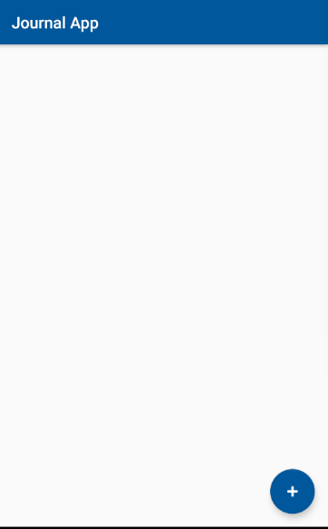

# The Journal App #
## Author: Thabo Ntsoko ##
## Date:   01 July 2018 ##

### This app is used for creating and managing diary entries. ###

#### The Journal App works in the following manner: ####
1. The user signs in to the app using his/her Google account.
2. Upon signing in, the user gets taken to the screen that allows them to add a diary entry.
   